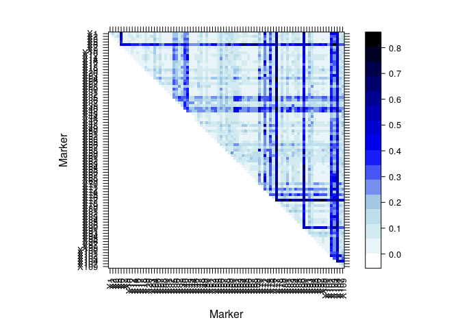

OhtaDStats Demo
================
Paul F. Petrowski & Timothy M. Beissinger
August 14, 2018

Contact Paul: <pfpetrowski@mail.missouri.edu>

Setup and Data Import
---------------------

If you haven't already, install the package using install.packages("ohtadstats")

``` r
library(ohtadstats)
data(miyashita_langley_data)
```

Computation of Ohta's D Statistics for a single Pair of Markers
---------------------------------------------------------------

If you are interested in computing Ohta's D statistics for a single pair of loci, you can do so by calling the dstat function.

``` r
dstat(index = c(28,41), data_set = miyashita_langley_data, tot_maf = 0.05, pop_maf = 0.01)
```

    ## [1] 2.000000 0.166618 0.005542 0.039825 0.018751 0.147867

The two loci to be evaluated are passed to the index argument as a two element vector.

Computation of Ohta's D statistics for a small dataset.
-------------------------------------------------------

If you have a small dataset and would like to compute Ohta's D statistics for each possible pair of loci, use the dwrapper function.

``` r
dwrap_results <- dwrapper(data_set = miyashita_langley_data, tot_maf = 0.00, pop_maf = 0.00)
summary(dwrap_results)
```

    ##           Length Class  Mode   
    ## d2it_mat  7225   -none- numeric
    ## d2is_mat  7225   -none- numeric
    ## d2st_mat  7225   -none- numeric
    ## dp2st_mat 7225   -none- numeric
    ## dp2is_mat 7225   -none- numeric
    ## npops_mat 7225   -none- numeric
    ## ratio1    7225   -none- numeric
    ## ratio2    7225   -none- numeric

``` r
dwrap_results$dp2is_mat[1:5,1:5]
```

    ##          X1       X2       X3       X5       X6
    ## X1 0.024606 0.116878 0.034934 0.073818 0.597310
    ## X2       NA 0.055363 0.059882 0.116878 0.443181
    ## X3       NA       NA 0.021948 0.034934 0.442826
    ## X5       NA       NA       NA 0.024606 0.383603
    ## X6       NA       NA       NA       NA 0.465850

Note that the dwrapper algorithm is big O N-squared. The amount of time required to analyze a dataset with dwrapper will increase dramatically with the number of loci. For this reason we recommend not using it except for on datasets less than one thousand loci. Anything larger than that should be evaluated using the dparallel workflow as described below.

Visualization of Results using dheatmap
---------------------------------------

The dheatmap function makes it easy to visualize results from dwrapper. Just pass it a matrix object.

``` r
map <- dheatmap(d_matrix = dwrap_results$dp2is_mat)
map
```



Parallel processing of a large dataset using dparallel
------------------------------------------------------

By taking advantage of high throughput computing platforms, datasets that would be intractable using dwrapper can be analyzed in a reasonable amount of time. The dparallel function makes it easy to distribute a large job across many threads.

Here's how dparallel might be used on a micro level.

``` r
dparallel(data_set = miyashita_langley_data, tot_maf = 0, pop_maf = 0, comparisons_per_job = 100, job_id = 1, outfile = "Ohta")
```

The function computes the first 100 pairwise comparisons to be made and outputs the results to a file named outfile\_jobid.csv, in this case that's Ohta\_1.csv. Let's see what those results look like.

``` r
results1 <- read.csv(file = "./Ohta_1.csv", header = TRUE, sep = ",")
head(results1)
```

    ##   Marker1 Marker2 nPops     D2it     D2is     D2st    Dp2st    Dp2is
    ## 1       1       1     3 0.047320 0.057471 0.015768 0.022714 0.024606
    ## 2       1       2     3 0.116963 0.002299 0.024260 0.000085 0.116878
    ## 3       1       3     3 0.034968 0.000000 0.008742 0.000034 0.034934
    ## 4       1       4     3 0.073856 0.001022 0.015768 0.000038 0.073818
    ## 5       1       5     3 0.598187 0.020689 0.118691 0.000877 0.597310
    ## 6       1       6     3 0.034250 0.000255 0.008582 0.000508 0.033742

``` r
tail(results1)
```

    ##     Marker1 Marker2 nPops     D2it     D2is     D2st    Dp2st    Dp2is
    ## 95        2      11     3 0.116963 0.002299 0.024260 0.000085 0.116878
    ## 96        2      12     3 0.099292 0.005172 0.018185 0.000756 0.098536
    ## 97        2      13     3 0.050525 0.000000 0.012631 0.000309 0.050216
    ## 98        2      14     3 0.078037 0.000000 0.019509 0.001165 0.076872
    ## 99        2      15     3 0.055060 0.000000 0.013765 0.000691 0.054369
    ## 100       2      16     3 0.116963 0.002299 0.024260 0.000085 0.116878

Similarly, we can process the second set of 100 comparisons by leaving comparisons\_per\_job at 100, and setting job\_id to 2.

``` r
dparallel(data_set = miyashita_langley_data, tot_maf = 0, pop_maf = 0, comparisons_per_job = 100, job_id = 2, outfile = "Ohta")
results2 <- read.csv(file = "./Ohta_2.csv", header = TRUE, sep = ",")
head(results2)
```

    ##   Marker1 Marker2 nPops     D2it     D2is     D2st    Dp2st    Dp2is
    ## 1       2      17     3 0.136692 0.000000 0.034173 0.001762 0.134930
    ## 2       2      18     3 0.054817 0.000000 0.013704 0.000242 0.054575
    ## 3       2      19     3 0.090433 0.012516 0.019202 0.001279 0.089154
    ## 4       2      20     3 0.043180 0.001596 0.010892 0.000149 0.043032
    ## 5       2      21     3 0.050525 0.000000 0.012631 0.000309 0.050216
    ## 6       2      22     3 0.042495 0.000000 0.010624 0.000274 0.042220

Notice that this computation has picked up right where the previous one left off. There is no gap or overlap.

Of course, dparallel is not meant to be executed in serial. The advantage to using it is that multiple instances can be executed at the same time. Consider a simple rscript called examparallel.R.

``` r
job_id <- commandArgs(TRUE)

data_set = miyashita_langley_data               #Path to your dataset
tot_maf = 0.1                                   #Minor allele frequency threshold for the total population
pop_maf = 0.05                                  #Minor allele frequency you would like to use for subpopulations
comparisons_per_job = 100                       #Number of comparisons each job will perform
outfile =  "Ohta"                               #Prefix for the file name that results will be written to. Do not include extension. Default is "ohta", which will 

ohtadstats::dparallel(data_set = data_set,
                      tot_maf = tot_maf,
                      pop_maf = pop_maf,
                      comparisons_per_job = comparisons_per_job,
                      job_id = as.integer(job_id[1]),
                      outfile = outfile)
```

Using a simple bash for loop, this rscript can be executed by many threads at once on a high throughput computing platform. The bash script might look something like this:

``` bash
n=1000        #Number of jobs to be run

for i in `seq 1 n`;
        do
                bash Rscript examparallel.R $i;
        done
```

This script is not likely to work as-is due to various requirements set by the schedulers that run HTC platforms, but the paradigm remains the same. For bash code that I use to execute dparallel in parallel, check out the AuxillaryScripts folder in the OhtaDStat GitHub repository.
